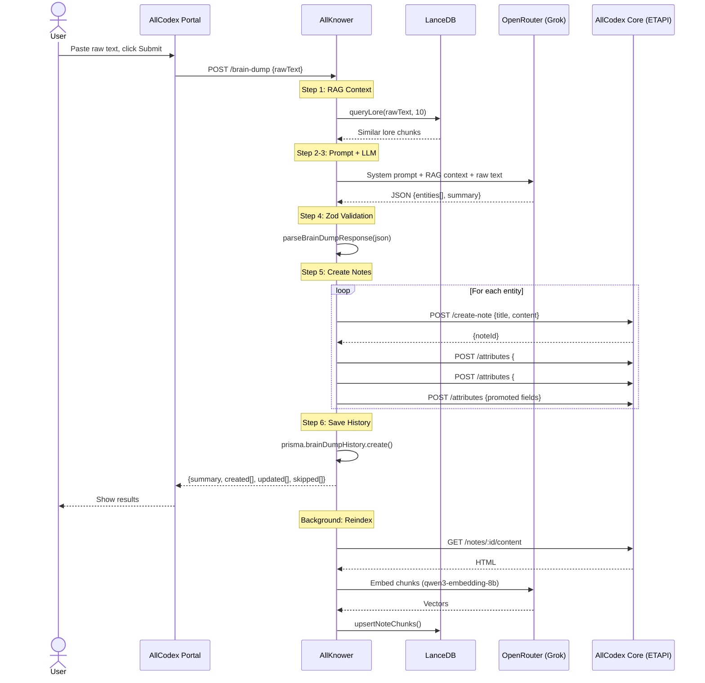
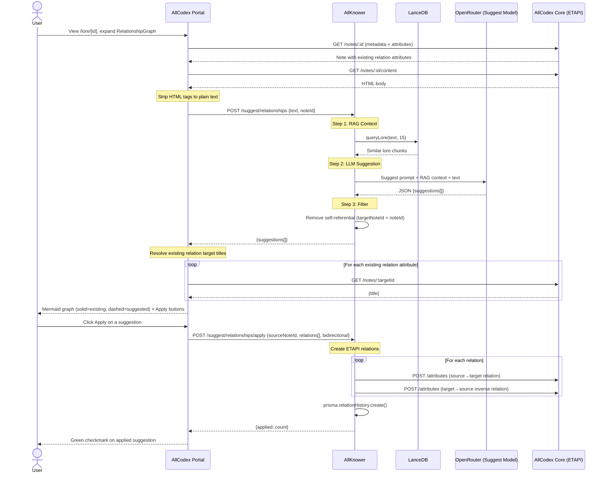

# AllCodex: Full Architecture Documentation

> A detailed breakdown of how AllCodex Core, AllKnower, and the AllCodex Portal work together to power the All Reach grimoire.

---

## Table of Contents

1. [System Overview](#1-system-overview)
2. [AllCodex Core (The Database)](#2-allcodex-core-the-database)
3. [AllKnower (The Brain)](#3-allknower-the-brain)
4. [AllCodex Portal (The Interface)](#4-allcodex-portal-the-interface)
5. [Data Flow: Brain Dump Pipeline](#5-data-flow-brain-dump-pipeline)
6. [Data Flow: Lore Browsing](#6-data-flow-lore-browsing)
7. [Data Flow: AI Analysis Tools](#7-data-flow-ai-analysis-tools)
8. [Data Flow: RAG Indexing](#8-data-flow-rag-indexing)
9. [Data Flow: Public Share Pages](#9-data-flow-public-share-pages)
10. [Authentication and Credentials](#10-authentication-and-credentials)
11. [AllCodex Core Internals: How Trilium Works](#11-allcodex-core-internals-how-trilium-works)
12. [AllCodex Core Customizations](#12-allcodex-core-customizations)
13. [AllKnower Internals](#13-allknower-internals)
14. [Portal Internals](#14-portal-internals)
15. [Mermaid Diagram](#15-mermaid-diagram)

---

## 1. System Overview

The ecosystem is three services:

| Service | Repo | Stack | Port | Role |
|---|---|---|---|---|
| **AllCodex Core** | `allcodex-core/` | Node.js, Express 5, SQLite, EJS | 8080 | Lore database. Stores every note, attribute, and relation. Serves ETAPI and public share pages. |
| **AllKnower** | `allknower/` | Bun, Elysia, PostgreSQL, LanceDB | 3001 | AI orchestrator. Runs brain dumps, embeddings, consistency checks, relationship suggestions, gap detection. |
| **AllCodex Portal** | `allcodex-portal/` | Next.js 16, React 19, TanStack Query, shadcn/ui | 3000 | Web frontend. The user never touches AllCodex Core or AllKnower directly; the Portal is the single interface. |

Communication is unidirectional for data writes:

```
User -> Portal -> AllKnower    -> AllCodex Core (for brain dumps)
User -> Portal -> AllCodex Core  (for direct CRUD)
User -> Portal -> AllKnower      (for AI analysis)
```

AllCodex Core never calls AllKnower. AllKnower calls AllCodex Core (via ETAPI) to read and write notes. The Portal calls both backends through its own Next.js API routes (server-side only, never from the browser).

---

## 2. AllCodex Core (The Database)

### What it is

A server-only fork of TriliumNext/Trilium v0.101.3. The original desktop client, Electron app, and web clipper have been removed. What remains:

- The Express 5 HTTP server
- SQLite database (via better-sqlite3)
- ETAPI (the external REST API)
- The share system (public page rendering)
- The hidden subtree (built-in system notes)
- The search engine (full-text + attribute queries)

### How it stores data

Everything is a **note**. Notes have:

| Field | Description |
|---|---|
| `noteId` | Unique alphanumeric ID |
| `title` | Display name |
| `type` | `text`, `code`, `file`, `image`, `search`, `book`, `noteMap`, `webView`, `mermaid` |
| `mime` | MIME type (`text/html` for text notes) |
| `isProtected` | Encrypted at rest, requires password to view |
| `dateCreated` / `dateModified` | Timestamps |

Content (the HTML body) is stored separately in a `blobs` table joined by `blobId`.

### How notes relate to each other

Notes are organized in a **tree** via **branches**. A branch links a parent note to a child note with a position number. A single note can have multiple parents (multi-parent tree, not a strict hierarchy).

**Attributes** attach metadata to notes:

| Attribute type | What it does |
|---|---|
| `label` | Key-value pair on a note. Example: `#loreType = "character"` |
| `relation` | Points from one note to another. Example: `~template = "_template_character"` |

Labels can be **promoted** (displayed as a structured form at the top of a note) or inheritable (automatically applied to child notes).

### ETAPI endpoints

AllCodex Core exposes a REST API under `/etapi/`:

| Method | Path | Description |
|---|---|---|
| `POST` | `/create-note` | Create a note and place it in the tree |
| `GET` | `/notes?search=...` | Full-text and attribute search |
| `GET` | `/notes/:id` | Get note metadata and attributes |
| `GET/PUT` | `/notes/:id/content` | Read/write the HTML body |
| `PATCH` | `/notes/:id` | Update title, type, mime |
| `DELETE` | `/notes/:id` | Delete a note |
| `POST` | `/attributes` | Create a label or relation |
| `PATCH/DELETE` | `/attributes/:id` | Update or remove an attribute |
| `POST` | `/branches` | Create a parent-child link |
| `GET` | `/app-info` | Server version and status |

Auth: token-based. Create an ETAPI token in AllCodex Options. Pass it in the `Authorization` header on every request.

Interactive API docs are served at `/docs` (Scalar UI). The OpenAPI spec is at `/etapi/openapi.json`.

### Cache layers

AllCodex Core has two in-memory caches:

1. **Becca** (Backend Cache): the primary data layer. All notes, branches, attributes, and revisions are loaded into memory on startup. Every write goes to both SQLite and Becca. All reads come from Becca, never from disk. This is why AllCodex is fast even for large databases.

2. **Shaca** (Share Cache): a lightweight read-only cache for public shared notes. Only notes under the `#shareRoot` subtree are loaded. The share page renderer reads from Shaca.

### Search engine

AllCodex Core search supports:

- Full-text: `"towers tolkien"` (quotes for phrases)
- Label filters: `#loreType=character`, `#status=alive`
- Relation filters: `~template = "_template_character"`
- Logical operators: `AND`, `OR`, `NOT`
- Ordering: `orderBy:dateModified`

The search engine lives in `apps/server/src/services/search/`. It parses query strings into expression trees, evaluates them against Becca, and returns scored results.

---

## 3. AllKnower (The Brain)

### What it is

An Elysia server running on Bun. It provides AI-powered features that AllCodex cannot do on its own:

- **Brain Dump Pipeline**: raw text in, structured lore notes out
- **RAG System**: vector embeddings of all lore for semantic search
- **Consistency Checker**: finds contradictions across the grimoire
- **Relationship Suggester**: recommends connections between entities
- **Gap Detector**: identifies underdeveloped areas
- **Lore Autocomplete**: instant title suggestions

### How it stores data

AllKnower uses two databases:

1. **PostgreSQL** (via Prisma): stores user accounts, session tokens, brain dump history, RAG index metadata, and app config.

2. **LanceDB** (embedded, on-disk): stores vector embeddings of all lore chunks. No separate server needed; LanceDB runs in-process.

### Models used

All LLM and embedding calls go through OpenRouter. Each task has a configurable primary model plus up to two fallbacks (all env-overridable). OpenRouter handles failover server-side with a single HTTP request.

| Task | Default Model | Purpose |
|---|---|---|
| Brain Dump | `x-ai/grok-4.1-fast` | Entity extraction from raw text |
| Consistency Check | `moonshotai/kimi-k2.5` | RAG-augmented contradiction detection |
| Relationship Suggestions | `aion-labs/aion-2.0` | Connection proposals |
| Gap Detection | `aion-labs/aion-2.0` | Coverage analysis |
| Embeddings | `qwen/qwen3-embedding-8b` | 4096-dim vectors for semantic search |
| Autocomplete | `liquid/lfm-24b` | Instant title suggestions |
| Rerank | `openai/gpt-5-nano` | Re-ranks RAG results by relevance |

> **Note:** All model defaults can be overridden in `.env` via `BRAIN_DUMP_MODEL`, `CONSISTENCY_MODEL`, `SUGGEST_MODEL`, `GAP_DETECT_MODEL`, `AUTOCOMPLETE_MODEL`, `RERANK_MODEL` (each with `_FALLBACK_1` / `_FALLBACK_2` variants). Setting `USE_OPENROUTER_AUTO=true` routes all tasks through `openrouter/auto`.

### AllKnower API routes

| Method | Path | Description |
|---|---|---|
| `POST` | `/brain-dump` | Run the full extraction pipeline (mode: `auto` \| `review` \| `inbox`) |
| `POST` | `/brain-dump/commit` | Commit reviewed entities from review mode |
| `GET` | `/brain-dump/history` | Recent brain dump log |
| `GET` | `/brain-dump/history/:id` | Single brain dump detail by ID |
| `POST` | `/rag/query` | Semantic similarity search |
| `POST` | `/rag/reindex/:noteId` | Reindex one note |
| `POST` | `/rag/reindex` | Full corpus reindex |
| `POST` | `/rag/reindex-stale` | Reindex only notes changed since last embedding |
| `GET` | `/rag/status` | Index stats (count + last indexed) |
| `POST` | `/consistency/check` | RAG-augmented consistency scan |
| `POST` | `/suggest/relationships` | Suggest narrative connections |
| `POST` | `/suggest/relationships/apply` | Persist approved suggestions as AllCodex relation attributes |
| `GET` | `/suggest/gaps` | Detect underdeveloped lore areas |
| `GET` | `/suggest/autocomplete?q=...` | Title autocomplete (3-phase: prefix → RAG → LLM) |
| `POST` | `/import/system-pack` | Import SRD/system JSON packs as statblock notes |
| `POST` | `/import/azgaar` | Import an Azgaar Fantasy Map Generator export |
| `POST` | `/import/azgaar/preview` | Preview an Azgaar map export |
| `POST` | `/setup/seed-templates` | Create lore templates in AllCodex |
| `GET` | `/health` | Service health (AllCodex, Postgres, LanceDB) |
| `POST` | `/api/auth/sign-up/email` | Register a new AllKnower account |
| `POST` | `/api/auth/sign-in/email` | Login and receive a bearer token |
| `POST` | `/api/auth/sign-out` | Invalidate the current session |
| `GET` | `/api/auth/session` | Verify session and retrieve user info |

Interactive API docs (Scalar UI) are served at `/reference`. OpenAPI spec at `/reference/json`.

Auth: better-auth (email/password + Bearer token). All AI routes require `Authorization: Bearer <token>`. The Portal collects credentials and proxies auth calls server-side — no HTML login pages are served by AllKnower.

---

## 4. AllCodex Portal (The Interface)

### What it is

A Next.js 16 app with React 19. It is the only thing the user interacts with. The Portal never exposes AllCodex or AllKnower credentials to the browser; all backend calls happen server-side in Next.js API routes.

### Stack

| Layer | Tech |
|---|---|
| Framework | Next.js 16 (App Router) |
| React | 19 with React Compiler |
| Data fetching | TanStack Query (30s stale time, 1 retry) |
| State | `useState` for ephemeral component state; **Zustand** for shared AI tool state (`useAIToolsStore`) and brain dump state (`useBrainDumpStore`) |
| UI components | shadcn/ui (Radix primitives + Tailwind) |
| Editor | Novel v1 (`LoreEditor`) — Novel-wrapped Tiptap with slash commands, bubble menu, `@`-mentions, tables, images |
| Dark theme | Cinzel (headings) + Crimson Text (body) fonts |
| Drawer/sheets | Vaul |

### Pages

| Route | Page | Description |
|---|---|---|
| `/` | Dashboard | Stat cards, recent entries grid, quick actions, system status |
| `/lore` | Lore Browser | Two-panel layout: `LoreTree` sidebar (type-category filter with counts) + filterable card grid. |
| `/lore/new` | New Entry | `TemplatePicker` modal to select a lore type, then title + `LoreEditor` (Novel/Tiptap) + `PromotedFields` for template-specific attributes. |
| `/lore/[id]` | Note Detail | Two-column: rendered content + sidebar with labels, relations, `RelationshipGraph` (on-demand Mermaid diagram of existing + AI-suggested connections with per-suggestion Apply buttons), and "Suggest Connections" button. |
| `/lore/[id]/edit` | Edit Note | Title, `TemplatePicker` (template switcher), `LoreEditor` (Novel/Tiptap rich text), `PromotedFields`, draft toggle (`#draft` label), delete with confirmation. |
| `/brain-dump` | Brain Dump | Textarea for raw text. Shows results (created/updated entities) + history. State managed by `useBrainDumpStore`. |
| `/search` | Search | Dual-mode: Semantic (RAG via AllKnower) or Attribute (ETAPI query via AllCodex) |
| `/ai/consistency` | Consistency | Optional note IDs input. Runs scan, shows issues by severity. State managed by `useAIToolsStore`. |
| `/ai/gaps` | Gap Detector | One-click scan. Shows gaps grouped by severity with suggestions. State managed by `useAIToolsStore`. |
| `/ai/relationships` | Relationships | Text input (auto-populated with note content when opened from a note detail page via `?noteId=`). Passes `noteId` to AllKnower to filter self-referential suggestions. Each suggestion has an Apply button that persists the relation bidirectionally. State managed by `useAIToolsStore`. |
| `/quests` | Quests | Quest tracker with status filter, completion toggle, quest detail cards. |
| `/session` | Session Workspace | Live session: pinned recap, scene notes, quick-create, statblock lookup, timer. |
| `/timeline` | Timeline | Chronological event list with sort, date display, and in-world dates. |
| `/statblocks` | Statblock Library | CR-filterable, searchable statblock card grid with full stat display. |
| `/shared` | Shared Content | Share browser with share toggle, password set, and preview links. |
| `/import` | Import | System pack importer with preview, duplicate-skip, and result reporting. |
| `/brain-dump/[id]` | Brain Dump Detail | Single brain dump history detail (raw text, entities, metadata). |
| `/settings` | Settings | Three sections: AllCodex connection, AllKnower connection, Share Configuration (share root, default visibility), and Portal Config. |

### How the Portal talks to backends

The Portal's API routes (`app/api/`) act as a secure proxy:

```
Browser  ->  Next.js API Route (server-side)  ->  AllCodex ETAPI
                                               ->  AllKnower API
```

Credentials are stored in HTTP-only cookies (set via `/api/config/connect`) or fall back to environment variables in `.env.local`. The browser never sees ETAPI tokens or AllKnower Bearer tokens.

Two server-side client libraries handle the calls:
- `lib/etapi-server.ts`: wraps AllCodex ETAPI (searchNotes, getNote, createNote, etc.)
- `lib/allknower-server.ts`: wraps AllKnower API (runBrainDump, checkConsistency, etc.)

---

## 5. Data Flow: Brain Dump Pipeline

This is the core feature. The user pastes raw worldbuilding text and gets structured notes.

**Step by step:**

1. **User** types raw text in the Portal brain dump page and clicks submit.
2. **Portal** sends `POST /api/brain-dump` (browser to Next.js).
3. **Portal API route** reads AllKnower credentials from cookies, calls `POST /brain-dump` on AllKnower with the raw text and a `mode` parameter (`auto` | `review` | `inbox`). In `auto` mode, entities are written immediately. In `review` mode, entities are returned as proposals for user approval before a separate `POST /brain-dump/commit` writes them.
4. **AllKnower** receives the text. Starts the pipeline:

   a. **RAG Context Retrieval**: queries LanceDB for the 10 most semantically similar existing lore chunks. This prevents the LLM from contradicting existing lore. For statblock-type entities, a second grounded RAG pass fetches existing statblocks to provide system-stat context.

   b. **Prompt Construction**: builds a system prompt (role: lore architect, output format: strict JSON schema, constraints: no inventing details, no contradictions) and a user prompt (the raw text + RAG context).

   c. **LLM Call**: sends the prompt to `x-ai/grok-4.1-fast` via OpenRouter. The model returns a JSON object with `entities[]` and a `summary`.

   d. **Zod Validation**: the response is parsed through `LLMResponseSchema`. Invalid entities are dropped individually (best-effort partial parse); valid ones proceed.

   e. **Note Creation Loop**: for each entity:
      - If `action: "update"` and `existingNoteId` is set: PATCH the note title and PUT the content via ETAPI.
      - If `action: "create"`: POST `/etapi/create-note` under the lore root. Then:
        1. Try to link the lore template (best-effort, won't fail if template missing)
        2. Add `#lore` label
        3. Add `#loreType=<type>` label
        4. Write each promoted attribute (fullName, race, etc.) as individual labels
        5. Apply any tags

   f. **History Recording**: saves the brain dump to PostgreSQL (raw text, parsed JSON, created/updated note IDs, model, token count).

5. **AllKnower** returns the result: `{ summary, created[], updated[], skipped[] }`.
   - In `auto` mode, all entities are committed immediately.
   - In `review` mode, the result contains `entities[]` as proposals. The user reviews and approves them in the Portal, then `POST /brain-dump/commit` writes the approved subset.
   - In `inbox` mode, the raw text is queued for later processing.
6. **Portal API route** returns this to the browser.
7. **Portal** re-fetches brain dump history via TanStack Query invalidation.
8. **Background**: the brain dump route schedules RAG reindexing for all newly created/updated note IDs.

---

## 6. Data Flow: Lore Browsing

1. **User** opens `/lore` in the Portal.
2. **Portal** calls `GET /api/lore?q=%23lore` (default: search for all notes with `#lore` label).
3. **Portal API route** calls AllCodex ETAPI `GET /etapi/notes?search=%23lore&limit=200`.
4. **AllCodex** evaluates the search against Becca (in-memory cache), returns matching notes with their attributes.
5. **Portal** renders a card grid. Each card shows: title, loreType badge (color-coded), date, attribute preview.
6. Clicking a card navigates to `/lore/[id]`.
7. **Detail view** makes two parallel calls: `GET /api/lore/[id]` (metadata + attributes) and `GET /api/lore/[id]/content` (HTML body).
8. Both route through the Portal API to AllCodex ETAPI.

---

## 7. Data Flow: AI Analysis Tools

### Consistency Check

1. User optionally enters note IDs, clicks "Run".
2. Portal calls `POST /api/ai/consistency` -> AllKnower `POST /consistency/check`.
3. **Explicit mode** (note IDs provided): AllKnower fetches those notes from AllCodex, strips HTML to plain text, sends full content to the LLM.
4. **Semantic sampling mode** (no note IDs): AllKnower runs 4 semantic RAG probes (`characters/relationships`, `world rules/magic`, `timeline/events`, `contradictions/anomalies`) to surface the most consistency-relevant lore entries. Up to 2,000 chars per note are included.
5. Sends sampled notes to `moonshotai/kimi-k2.5` with a system prompt asking for contradictions, timeline conflicts, orphaned references, and naming issues.
6. Returns `{ issues[], summary }` with severity and affected note IDs.

### Relationship Suggestions

1. User enters text (or navigates from a note detail page — the portal fetches and strips the note's HTML content automatically).
2. Portal calls `POST /api/ai/relationships { text, noteId? }` -> AllKnower `POST /suggest/relationships`.
   - `noteId` is passed when known so AllKnower can label the prompt context correctly and filter out self-referential suggestions (where `targetNoteId === noteId`).
3. AllKnower queries LanceDB for the 15 most similar lore chunks (cosine metric, hybrid reranking).
4. Sends the text + context to the suggest model asking for plausible narrative connections.
5. Returns `{ suggestions[] }` with target note IDs, relationship types, confidence, and descriptions.
6. Apply is available in two places:
   - **`RelationshipGraph` sidebar** on `/lore/[id]`: shows existing relations + AI suggestions as a Mermaid graph. Each suggestion has an Apply button that calls `PUT /api/ai/relationships`.
   - **`/ai/relationships` page**: each suggestion card has an Apply button (only when `noteId` is present in the URL).
7. Apply calls `PUT /api/ai/relationships { sourceNoteId, relations[], bidirectional }` -> AllKnower `POST /suggest/relationships/apply`. Each applied relation is logged to `relation_history`. Applied suggestions show a green checkmark in the UI.

### Gap Detection

1. User clicks "Scan for Gaps".
2. Portal calls `GET /api/ai/gaps` -> AllKnower `GET /suggest/gaps`.
3. AllKnower fetches all `#lore` notes from AllCodex, counts them by `#loreType`.
4. Sends the type distribution to Grok for analysis.
5. Returns `{ gaps[], summary, typeCounts }`.

---

## 8. Data Flow: RAG Indexing

RAG keeps LanceDB in sync with AllCodex so semantic search works.

### Single-note indexing (after brain dump)

1. Brain dump creates/updates notes, collects their IDs as `reindexIds`.
2. The brain dump route hands these IDs to a background job.
3. For each note ID, the indexer:
   a. Fetches HTML content from AllCodex via ETAPI.
   b. Strips HTML tags to plain text.
   c. Chunks the text (splits into smaller segments).
   d. Embeds each chunk via `qwen/qwen3-embedding-8b` through OpenRouter (4096-dim vectors).
   e. Upserts into LanceDB: deletes old chunks for that noteId, inserts new ones.
   f. Updates `rag_index_meta` in PostgreSQL (noteId, noteTitle, chunkCount, model, timestamp).

### Full reindex

1. User/admin calls `POST /rag/reindex`.
2. AllKnower fetches all `#lore` notes from AllCodex.
3. Indexes each one sequentially (same process as above).
4. Returns `{ indexed, failed }` counts.

### Semantic query

1. Any part of the system that needs similar lore calls `queryLore(text, topK)`.
2. The query text is embedded into a vector.
3. LanceDB performs ANN search with explicit cosine distance metric.
4. A base threshold of 0.3 similarity filters out low-quality matches.
5. **Hybrid reranking** is applied based on query complexity:
   - Simple queries (≤8 words, no relational connectives) → Xenova cross-encoder (local, fast)
   - Complex queries (>8 words or contains how/why/between/etc.) → LLM-as-a-Judge
6. Results are deduplicated per note (highest-scoring chunk wins), then sliced to `topK`.
7. Returns chunks ranked by score, with noteId, noteTitle, content, and score.

### Stale reindex

`POST /rag/reindex-stale` compares each lore note's `utcDateModified` in AllCodex against its `embeddedAt` timestamp in `rag_index_meta`. Only notes modified since last embedding are reprocessed — safe to run on a schedule.

---

## 9. Data Flow: Public Share Pages

AllCodex can publish notes as public web pages (no auth required).

1. A note with `#shareRoot` becomes the root of a public share tree.
2. Notes under the share root are accessible at `http://localhost:8080/share/<shareId>`.
3. The content renderer (`content_renderer.ts`) processes each note:
   - Notes labeled `#gmOnly` are completely hidden (empty content returned).
   - HTML elements with `class="gm-only"` are stripped from the output.
   - `{{variableName}}` placeholders are expanded using JSON from notes labeled `#worldVariables`.
   - Internal note links are resolved to share URLs.
   - Code blocks get syntax highlighting.
   - Mermaid diagrams are rendered as images.
   - Include notes (`<section class="include-note">`) are expanded inline.
4. The result is rendered through an EJS template with navigation, dark/light mode toggle, and customizable CSS/JS.

---

## 10. Authentication and Credentials

### AllCodex Core (ETAPI)

- Token-based auth. Create a token in AllCodex Core Options.
- The token is passed as `Authorization: <token>` on every ETAPI request.
- Also supports HTTP Basic auth and password login.

### AllKnower

- Uses better-auth (headless — no HTML pages served).
- **Register**: `POST /api/auth/sign-up/email` with `{ email, name, password }`. Returns session token.
- **Login**: `POST /api/auth/sign-in/email` with `{ email, password }`. Returns session token.
- The response includes a `Set-Cookie` header (for browser sessions) and the JSON body contains the token for programmatic use via the `bearer()` plugin.
- All protected routes require `Authorization: Bearer <token>`.
- Rate limiting on brain dump endpoint (default: 10 requests per 60 seconds).

### Portal Credential Flow

The Portal stores credentials in HTTP-only cookies so the browser never sees raw tokens:

1. **Settings page**: user enters AllCodex Core URL + token (or password for auto-login).
2. Portal calls `POST /api/config/connect` which sets `allcodex_url` and `allcodex_token` as HTTP-only cookies.
3. For AllKnower: the Settings page shows the service status and two buttons — **Login** and **Register**. The user enters URL + email/password and clicks one.
4. Portal calls `POST /api/config/allknower-login` or `POST /api/config/allknower-register` (Next.js API route, server-side).
5. That route forwards the credentials to AllKnower at `POST /api/auth/sign-in/email` or `POST /api/auth/sign-up/email`.
6. better-auth returns `{ token, user }`. The Portal extracts the token and sets it as an `allknower_token` HTTP-only cookie alongside the `allknower_url`.
7. On every subsequent API call, `lib/get-creds.ts` reads credentials from cookies. Falls back to env vars if cookies are absent.
8. `POST /api/config/disconnect` clears the cookies.
9. `GET /api/config/status` probes both services' health endpoints and returns `{ connected: boolean, user?: string }` for AllKnower.

### 10.4 Authentication Flow (Headless — full detail)

AllKnower is a pure API server. It serves no HTML, no login forms. The Portal owns the UI.

**Registration:**
```
Browser (Settings)  POST /api/config/allknower-register  { url, email, name, password }
  -> Next.js API route  POST <allknower_url>/api/auth/sign-up/email  { email, name, password }
  <- better-auth returns  { token, user }
  -> Next.js sets HTTP-only cookie: allknower_token, allknower_url
  <- Browser sees: { connected: true, user: "email@example.com" }
```

**Login:**
```
Browser (Settings)  POST /api/config/allknower-login  { url, email, password }
  -> Next.js API route  POST <allknower_url>/api/auth/sign-in/email  { email, password }
  <- better-auth returns  { token, user }
  -> Next.js sets HTTP-only cookie: allknower_token, allknower_url
  <- Browser sees: { connected: true, user: "email@example.com" }
```

**Authenticated API request (brain dump, etc.):**
```
Browser  POST /api/brain-dump  { text }
  -> Next.js reads allknower_token cookie via get-creds.ts
  -> POST <allknower_url>/brain-dump  Authorization: Bearer <token>
  <- AllKnower auth-guard validates token with better-auth
  <- Result returned to browser
```

---

## 11. AllCodex Core Internals: How Trilium Works

### Startup sequence

1. `main.ts` initializes i18n translations, then imports `www.ts`.
2. `www.ts` checks Node.js version (minimum 20.0.0), logs system info (CPU, DB size, data dir), starts Express.
3. Becca loads all entities from SQLite into memory.
4. Express registers all route handlers (API, ETAPI, share).
5. WebSocket server starts for real-time sync.
6. Server listens on port 8080.

### How notes are created internally

When ETAPI receives `POST /create-note`:

1. `notes.ts` validates input, derives MIME type from note type.
2. A new `noteId` is generated (or the provided one is used).
3. A `BNote` row is inserted into SQLite and Becca.
4. Content blob is created in the `blobs` table.
5. A `BBranch` is created linking the note to its parent.
6. If the parent has `child:` attribute definitions, those are copied to the new note.
7. Entity change events are emitted for sync.

### How search works internally

1. The query string is parsed into an expression tree by the search parser.
2. Label expressions (`#lore`) look up notes by attribute in Becca.
3. Full-text expressions scan note titles and content.
4. Expressions are combined with AND/OR/NOT logic.
5. Results are scored and returned as `SearchResult[]`.

### The hidden subtree

Trilium has a "hidden" note subtree for system notes (templates, search defaults, etc.). It's not visible in the regular tree but accessible by ID. AllCodex Core adds lore templates here under `_templates_lore`.

---

## 12. AllCodex Core Customizations

Changes made to the Trilium fork for AllCodex Core:

### Branding

- App name: "AllCodex" everywhere (ETAPI app-info, startup banner, package.json, README).
- ASCII art banner changed from Trilium to AllCodex.
- i18n strings updated: "note" -> "lore", "tree" -> "chronicle", "New note" -> "New Lore Entry", etc.

### Lore Templates (hidden_subtree_templates.ts)

**21 templates** added under a "Lore Templates" book note:

| Template | ID | Icon | Key Promoted Attributes |
|---|---|---|---|
| Character | `_template_character` | `bx-user` | fullName, aliases, age, race, gender, affiliation, role, status, secrets, goals |
| Location | `_template_location` | `bx-map-pin` | locationType, region, population, ruler, secrets, geolocation |
| Faction | `_template_faction` | `bx-shield` | factionType, foundingDate, leader, goals, secrets, status |
| Creature | `_template_creature` | `bx-bug` | creatureType, habitat, diet, dangerLevel, abilities |
| Event | `_template_event` | `bx-calendar-event` | inWorldDate, outcome, consequences, secrets |
| Timeline | `_template_timeline` | `bx-time-five` | calendarSystem (book type, sorted by inWorldDate) |
| Manuscript | `_template_manuscript` | `bx-book-open` | genre, manuscriptStatus, wordCount |
| Statblock | `_template_statblock` | `bx-list-check` | crName, challengeRating, crLevel, creatureType, size, alignment, ac, hp, speed, str–cha, immunities, resistances, vulnerabilities, abilities, actions, legendaryActions. Also carries `#statblock` label. |
| Item / Artifact | `_template_item` | `bx-diamond` | itemType, rarity, creator, magicProperties, history |
| Spell / Magic | `_template_spell` | `bx-meteor` | school, level, castingTime, range, components, duration |
| Building / Structure | `_template_building` | `bx-building-house` | buildingType, owner, purpose, condition, secrets |
| Language / Script | `_template_language` | `bx-font-family` | languageFamily, speakers, script, samplePhrase |
| Session | `_template_session` | `bx-game` | sessionDate, players, sessionStatus, recap, hooks, gmNotes |
| Quest | `_template_quest` | `bx-target-lock` | questStatus, questGiver, reward, location, hooks, consequences. Also carries `#quest` label. |
| Scene | `_template_scene` | `bx-clapperboard` | location, participants, outcome, gmNotes |
| Organization | `_template_organization` | `bx-buildings` | orgType, leader, headquarters, membership, purpose, status |
| Race / Species | `_template_race` | `bx-dna` | homeland, lifespan, traits, culture, relations |
| Myth / Legend | `_template_myth` | `bx-book-bookmark` | mythType, origin, truthStatus, relatedEntities |
| Cosmology | `_template_cosmology` | `bx-planet` | planes, cosmicForces, afterlife, creationMyth |
| Deity | `_template_deity` | `bx-crown` | domain, alignment, symbol, worshippers, divineStatus |
| Religion | `_template_religion` | `bx-church` | deity, tenets, practices, holyText, faithStatus |

Each template carries the `#template` label and defines promoted attributes using Trilium's `label:fieldName = "promoted,alias=Display Name,single,text"` syntax. When a note's `~template` relation points to one of these, Trilium renders the promoted fields as a structured form.

### GM-Only Secrets (content_renderer.ts)

Two-layer hiding in the share renderer:

1. **Note-level**: `#gmOnly` label on a note. The entire note returns empty content in shared output.
2. **Section-level**: `class="gm-only"` on any HTML element. That element is stripped from the rendered share page.

Only affects public `/share/` rendering. The note content is fully visible in ETAPI and the Portal.

### World Variables (content_renderer.ts)

A `{{variableName}}` replacement system:

1. Create a note with the `#worldVariables` label.
2. Set its content to JSON: `{ "currency": "Aurens", "capital": "Solara" }`.
3. In any other note, write `{{currency}}` and it expands to "Aurens" on share pages.

Multiple `#worldVariables` notes are merged. Values are HTML-escaped.

### API Documentation

Scalar interactive docs at `/docs`. OpenAPI JSON at `/etapi/openapi.json` (CORS-open for LLM/AI agents).

> **AllKnower** serves its own interactive docs at `/reference` (Scalar UI via `@elysiajs/openapi`).

---

## 13. AllKnower Internals

### Project structure

```
src/
  index.ts              App bootstrap entry point
  app.ts                Elysia app instance, route registration
  env.ts                Zod-validated environment variables
  auth/index.ts         better-auth setup (email/password, Bearer)
  db/client.ts          Prisma client with pretty-printed query logging
  etapi/client.ts       AllCodex Core ETAPI wrapper (createNote, tagNote, etc.)
  logger.ts             Root logger instance (Winston-based with PnP support)
  pipeline/
    azgaar.ts           Azgaar FMG map import logic
    brain-dump.ts       Main orchestrator (RAG -> LLM -> parse -> ETAPI)
    model-router.ts     Per-task model selection with OpenRouter fallbacks
    prompt.ts           System/user prompt builders + callLLM()
    parser.ts           Zod parser for LLM JSON responses
    relations.ts        Relationship suggestion pipeline logic
    session-compactor.ts Tier 3 context compaction logic
    prompts/
      autocomplete.ts   System prompt for title autocomplete suggestions
      consistency.ts    System prompt for continuity editor
      gap-detect.ts     System prompt for worldbuilding gap analysis
      suggest.ts        System prompt for relationship suggestion
    schemas/
      llm-response-schemas.ts   JSON Schema objects for OpenRouter structured output
      response-schemas.ts       Zod validation for suggestion/consistency/gap responses
  plugins/
    index.ts            CORS, rate limiting, background jobs
    auth-guard.ts       Session-based auth middleware
    request-id.ts       UUID-based request tracing plugin
  rag/
    chunk-compactor.ts  Tier 2 chunk summarization
    chunk-dedup.ts      Embedding-distance based chunk deduplication
    embedder.ts         OpenRouter embedding calls (qwen/qwen3-embedding-8b, 4096-dim)
    lancedb.ts          Vector store (connect, upsert, query, delete)
    indexer.ts          Sync AllCodex Core -> LanceDB
  routes/
    brain-dump.ts       POST /brain-dump (mode: auto|review|inbox), POST /brain-dump/commit, GET /brain-dump/history, GET /brain-dump/history/:id
    rag.ts              POST /rag/query, /rag/reindex, GET /rag/status
    consistency.ts      POST /consistency/check
    suggest.ts          POST /suggest/relationships, GET /suggest/gaps, /suggest/autocomplete
    health.ts           GET /health (deep check: AllCodex Core + Postgres + LanceDB)
    setup.ts            POST /setup/seed-templates
    import.ts           POST /import/system-pack, /import/azgaar
  types/
    lore.ts             Zod schemas (21 entity types, 17 relationship types, brain dump result, etc.)
  utils/
    tokens.ts           Token counting utilities
```

### Database schema (PostgreSQL via Prisma)

| Table | Purpose |
|---|---|
| `users` | better-auth user accounts |
| `sessions` | Login sessions with expiry |
| `accounts` | OAuth providers |
| `verifications` | Email verification tokens |
| `brain_dump_history` | Log of every brain dump (raw text, `rawTextHash` for idempotency dedup, parsed JSON, created/updated note ID arrays, model, token count) |
| `llm_call_log` | Append-only log of every LLM call (task, model, tokens, latencyMs, requestId) |
| `rag_index_meta` | Tracks which notes are indexed (noteId, title, chunk count, model, embeddedAt) |
| `app_config` | Key-value store for runtime settings (loreRootNoteId, etc.) |
| `relation_history` | Log of applied relation suggestions (sourceNoteId, targetNoteId, type, description) |
| `lore_sessions` | Multi-turn AI session states |
| `lore_session_messages` | Individual messages within a lore session with token counts |

### LanceDB schema

Single table `lore_embeddings`:

| Column | Type | Description |
|---|---|---|
| `noteId` | string | AllCodex note ID |
| `noteTitle` | string | Note title at index time |
| `chunkIndex` | number | Position in the note's chunk array |
| `content` | string | Plain text chunk |
| `vector` | float[4096] | Embedding from qwen/qwen3-embedding-8b |

---

## 14. Portal Internals

### Architecture

```
app/
  layout.tsx              Root: fonts (Cinzel, Crimson Text), Providers wrapper
  page.tsx                Redirects to /lore
  (portal)/
    layout.tsx            Sidebar + header shell
    page.tsx              Dashboard (stats, recent entries, quick actions)
    brain-dump/page.tsx   Brain dump textarea + history (state: useBrainDumpStore)
    brain-dump/[id]/page.tsx  Brain dump history detail (raw text, entities, metadata)
    lore/page.tsx         Filterable card grid
    lore/new/page.tsx     TemplatePicker -> LoreEditor + PromotedFields (create flow)
    lore/[id]/page.tsx    Detail view (content + sidebar) + RelationshipGraph
    lore/[id]/edit/       Edit title + LoreEditor (Tiptap) + TemplatePicker + PromotedFields + draft toggle
    search/page.tsx       Dual-mode: semantic (RAG) or attribute (ETAPI)
    quests/page.tsx       Quest tracker (status filter, completion toggle, quest cards)
    session/page.tsx      Live session workspace (recap, timer, statblock lookup, quick-create)
    timeline/page.tsx     Chronological event timeline with in-world dates
    statblocks/page.tsx   Statblock library (CR filter, search, full stat cards)
    shared/page.tsx       Shared content browser (share toggles, passwords, preview links)
    import/page.tsx       System pack import (preview, duplicate-skip, result reporting)
    ai/consistency/       Consistency checker UI (state: useAIToolsStore)
    ai/gaps/              Gap detector UI (state: useAIToolsStore)
    ai/relationships/     Relationship suggester + apply UI (state: useAIToolsStore)
    settings/page.tsx     Service connections + share config + portal config
  api/
    lore/route.ts             CRUD proxy to AllCodex ETAPI
    lore/[id]/attributes/     Create/delete label + relation attributes
    lore/[id]/backlinks/      Get notes that link to this note
    lore/[id]/breadcrumbs/    Get ancestor path for breadcrumb nav
    lore/[id]/content/        Read/write HTML note body
    lore/[id]/image/          Proxy image blobs for editor display
    lore/[id]/preview/        Player-safe rendered preview (strips GM-only content)
    lore/[id]/relationships/  AI relationship suggestions + existing relations for a specific note
    lore/autolink/            Scan note text for unlinked title matches
    lore/mention-search/      @-mention autocomplete (search by title prefix)
    lore/move/                Move a note to a different parent branch
    lore/note-search/         Search for lore notes by title/type
    lore/upload-image/        Upload image to AllCodex, return noteId
    images/[id]/              Proxy for internal image notes
    brain-dump/route.ts       Proxy to AllKnower brain dump (with mode param)
    brain-dump/commit/route.ts  Proxy to AllKnower brain dump commit
    brain-dump/history/route.ts  Proxy to AllKnower brain dump history
    brain-dump/history/[id]/route.ts  Proxy to AllKnower brain dump detail
    import/system-pack/route.ts  Proxy to AllKnower system pack import
    quests/route.ts           Quest CRUD proxy
    statblocks/route.ts       Statblock query proxy
    timeline/route.ts         Timeline event query proxy
    share/route.ts            Share settings CRUD (toggle, password, visibility)
    share/tree/route.ts       Share tree listing
    auth/sync/route.ts        Token cookie sync after AllKnower login
    ai/*/route.ts             Proxy to AllKnower AI endpoints (POST suggest, PUT apply)
    search/route.ts           Dual-mode search proxy
    rag/route.ts              Proxy to AllKnower RAG query
    config/                   Credential storage/retrieval (cookies), portal settings
    config/portal/            Portal-specific UI settings

lib/
  etapi-server.ts         Server-side AllCodex ETAPI client (notes, attributes, branches, search — 16 functions)
  allknower-server.ts     Server-side AllKnower API client (suggestRelationships, applyRelationships, etc.)
  get-creds.ts            Reads credentials from cookies or env vars
  route-error.ts          Error handling (ServiceError class)
  sanitize.ts             sanitizeLoreHtml() — DOMPurify-based HTML sanitizer for lore content
  lore-presentation.ts    Logic for lore presentation views
  utils.ts                Global portal utilities
  stores/
    ai-tools-store.ts     Zustand store for consistency / gaps / relationships page state
    brain-dump-store.ts   Zustand store for brain dump draft text (persisted to localStorage), result display, and expanded row state

components/
  portal/AppSidebar.tsx       Navigation (Chronicle, Studio, AI Tools, System)
  portal/LoreTree.tsx         Type-category sidebar (counts notes per loreType, drives grid filter)
  portal/MermaidDiagram.tsx   Generic client-side Mermaid renderer (lazy-loaded, grimoire-themed)
  portal/RelationshipGraph.tsx On-demand relationship diagram for any note (existing + AI suggestions + apply buttons)
  portal/ServiceBanner.tsx    Error/warning banners per service
  portal/ShareSettings.tsx    Share toggle + password + visibility controls per note
  portal/PreviewToggle.tsx    GM ↔ player preview switcher for shared content
  portal/StatblockCard.tsx    D&D-style statblock card (ability scores, HP, AC, CR, actions)
  portal/Breadcrumbs.tsx      Note ancestor path breadcrumb
  providers.tsx               TanStack Query + Tooltip providers
  editor/LoreEditor.tsx       BlockNote (Shadcn Edition) rich text editor with autolinker and mentions
  editor/TemplatePicker.tsx   Template selection modal (21 types: 20 typed + General Lore)
  editor/PromotedFields.tsx   Template-specific attribute form (fullName, race, etc.)
  editor/AutolinkerDialog.tsx Scans note text for unlinked title matches
  editor/mention.tsx          Lookup logic for lore mentions
  editor/mention-extension.tsx BlockNote integration for @-mentions
  ui/                         shadcn components (badge, button, card, dialog, etc.)
```

### Editor architecture

The lore editor (`LoreEditor.tsx`) wraps [BlockNote](https://www.blocknotejs.org/) (Shadcn Edition) with a worldbuilding-focused integration:

```
BlockNote (LoreEditor.tsx)
  ├─ Default Blocks (paragraphs, headings, lists, quotes, tables)
  ├─ Image Support (/api/lore/upload-image → AllCodex image note)
  ├─ Autolink Lore (slash command → scanning dialog)
  └─ Lore Mentions (@-trigger → note search dropdown)
```

| File | Purpose |
|---|---|
| `editor/LoreEditor.tsx` | Main editor component. Integrates BlockNote, manages autosave, and handles lore-specific triggers. |
| `editor/mention.tsx` | Search and menu logic for lore-aware autocomplete. |
| `editor/mention-extension.tsx` | BlockNote schema extension for custom `@-mention` nodes. |
| `editor/TemplatePicker.tsx` | Modal for selecting lore type (21 types available). |
| `editor/PromotedFields.tsx` | Dynamic form for template-specific attributes. |
| `editor/AutolinkerDialog.tsx` | Scans document for entity title matches; offers batch-link insertion. |

### Credential flow

```
Settings page -> POST /api/config/connect
  -> Sets HTTP-only cookies: allcodex_url, allcodex_token
  -> OR: POST /api/config/allcodex-login (password auth -> auto-obtains ETAPI token -> cookie)

Settings page (AllKnower) shows status card with Login / Register buttons
  -> POST /api/config/allknower-login   { url, email, password }
       -> Next.js calls POST <url>/api/auth/sign-in/email
       <- better-auth returns { token, user }
       -> Sets HTTP-only cookies: allknower_url, allknower_token
  -> POST /api/config/allknower-register  { url, email, name, password }
       -> Next.js calls POST <url>/api/auth/sign-up/email
       <- better-auth returns { token, user }
       -> Sets HTTP-only cookies: allknower_url, allknower_token

Every API route:
  -> get-creds.ts reads cookies (falls back to env vars)
  -> Passes creds to etapi-server.ts or allknower-server.ts
```

### Error handling

The Portal shows contextual banners when services are misconfigured or unreachable:

| Error Code | Banner Color | Message |
|---|---|---|
| `NOT_CONFIGURED` | Yellow | "Go to Settings to connect" |
| `UNAUTHORIZED` | Red | "Credentials are invalid" |
| `UNREACHABLE` | Red | "Service is unreachable" |
| `SERVICE_ERROR` | Red | Passthrough error message |

---

## 15. Mermaid Diagram

```mermaid
graph TB
    subgraph User["User (Browser)"]
        Browser["Browser<br/>localhost:3000"]
    end

    subgraph Portal["AllCodex Portal<br/>(Next.js 16 / React 19 / Bun)<br/>Port 3000"]
        direction TB
        Pages["Pages<br/>Dashboard | Lore Browser | Brain Dump<br/>Search | AI Tools | Settings"]
        APIRoutes["Next.js API Routes<br/>(server-side proxy)"]
        EtapiClient["lib/etapi-server.ts"]
        AkClient["lib/allknower-server.ts"]
        CredStore["lib/get-creds.ts<br/>(HTTP-only cookies + env fallback)"]
        Stores["Zustand Stores<br/>useAIToolsStore | useBrainDumpStore"]

        Pages --> Stores
        Pages --> APIRoutes
        APIRoutes --> CredStore
        CredStore --> EtapiClient
        CredStore --> AkClient
    end

    subgraph AllKnower["AllKnower<br/>(Elysia / Bun)<br/>Port 3001"]
        direction TB
        AkRoutes["Routes<br/>brain-dump | rag | consistency<br/>suggest | health | setup"]
        Pipeline["Pipeline<br/>brain-dump.ts | prompt.ts | parser.ts<br/>relations.ts | model-router.ts"]
        RAG["RAG<br/>embedder.ts | lancedb.ts | indexer.ts"]
        AkETAPI["etapi/client.ts<br/>(AllCodex ETAPI calls)"]
        AkAuth["better-auth<br/>(sessions + Bearer)"]

        AkRoutes --> Pipeline
        AkRoutes --> RAG
        Pipeline --> RAG
        Pipeline --> AkETAPI
        RAG --> AkETAPI
    end

    subgraph AllCodexCore["AllCodex Core<br/>(Express 5 / Node.js / SQLite)<br/>Port 8080"]
        direction TB
        ETAPI["ETAPI<br/>/etapi/*<br/>Notes | Attributes | Branches | Search"]
        ShareRenderer["Share Renderer<br/>/share/*<br/>gmOnly | variables | EJS"]
        Becca["Becca Cache<br/>(in-memory entity store)"]
        Shaca["Shaca Cache<br/>(share-only read cache)"]
        SQLite["SQLite Database<br/>notes | branches | attributes<br/>blobs | revisions | options"]
        Templates[\"Lore Templates (21 implemented)<br/>Character | Location | Faction | Creature | Event<br/>Timeline | Manuscript | Statblock | Item | Spell<br/>Building | Language | Session | Quest | Scene | Org | Race | Myth | Cosmology | Deity | Religion\"]

        ETAPI --> Becca
        ShareRenderer --> Shaca
        Becca --> SQLite
        Shaca --> SQLite
        Templates -.-> Becca
    end

    subgraph ExternalAPIs["External Services"]
        OpenRouter["OpenRouter API<br/>Brain Dump: x-ai/grok-4.1-fast<br/>Consistency: moonshotai/kimi-k2.5<br/>Suggest/Gap: aion-labs/aion-2.0<br/>Autocomplete: liquid/lfm-24b | Rerank: openai/gpt-5-nano<br/>Embed: qwen/qwen3-embedding-8b (4096-dim)"]
    end

    subgraph Storage["AllKnower Storage"]
        Postgres["PostgreSQL<br/>users | sessions | brain_dump_history<br/>rag_index_meta | app_config<br/>llm_call_log | relation_history"]
        LanceDB["LanceDB<br/>lore_embeddings<br/>(4096-dim vectors)"]
    end

    Browser <--> Pages

    EtapiClient -- "ETAPI token<br/>REST" --> ETAPI
    AkClient -- "Bearer token<br/>REST" --> AkRoutes

    AkETAPI -- "ETAPI token<br/>CRUD notes, attrs" --> ETAPI

    Pipeline -- "LLM calls" --> OpenRouter
    RAG -- "Embedding calls" --> OpenRouter

    AkRoutes --> Postgres
    RAG --> LanceDB

    ShareRenderer -- "Public pages<br/>(no auth)" --> Browser
    Browser -- "POST {token}<br/>(Auto Sync)" --> APIRoutes

    classDef portal fill:#1a1a2e,stroke:#e94560,color:#fff
    classDef allknower fill:#1a1a2e,stroke:#0f3460,color:#fff
    classDef allcodex fill:#1a1a2e,stroke:#16213e,color:#fff
    classDef external fill:#1a1a2e,stroke:#533483,color:#fff
    classDef storage fill:#1a1a2e,stroke:#0f3460,color:#fff
```

### Brain Dump Sequence



### Relationship Suggestion + Apply


